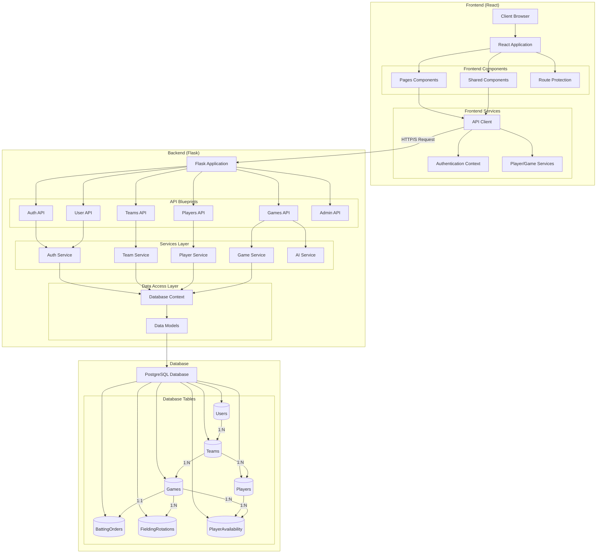

# LineupBoss Application Architecture

## System Architecture Diagram

## Component Descriptions

### Frontend Components

1. **React Application**: The main frontend application built with React.
   - Handles client-side routing via React Router
   - Manages global state and authentication

2. **Pages Components**:
   - Dashboard: Home page showing teams and user information
   - TeamDetail: Team management (players, games)
   - GameDetail: Game management (batting order, fielding rotations)
   - LandingPage: Public landing page with login/register options
   - AdminDashboard: User management for administrators

3. **Shared Components**:
   - Header: Application navigation
   - Footer: Site information
   - Form elements: Reusable input components

4. **Route Protection**:
   - ProtectedRoute: Ensures user authentication
   - AdminRoute: Restricts access to admin users

5. **Frontend Services**:
   - ApiClient: Handles API communication with path normalization
   - AuthContext: Manages authentication state and token handling
   - PlayerGameServices: Specific services for player and game operations

### Backend Components

1. **Flask Application**:
   - Main application entry point
   - Middleware for CORS, authentication, and error handling
   - Blueprint registration and route management

2. **API Blueprints**:
   - Auth API: Authentication and token management
   - User API: User profile management
   - Teams API: Team CRUD operations
   - Players API: Player CRUD operations
   - Games API: Game management, lineups, and rotations
   - Admin API: User administration and approvals

3. **Services Layer**:
   - Auth Service: Authentication logic and token management
   - Team Service: Team business logic
   - Player Service: Player business logic
   - Game Service: Game, lineup, and fielding rotation logic
   - AI Service: AI-generated fielding rotations

4. **Data Access Layer**:
   - Database Context: Session management and transactions
   - Model Layer: SQLAlchemy ORM models

### Database Components

1. **PostgreSQL Database**:
   - Relational database storing all application data

2. **Database Tables**:
   - Users: User accounts and roles
   - Teams: Baseball teams
   - Players: Team players
   - Games: Scheduled games
   - BattingOrders: Batting lineups for games
   - FieldingRotations: Fielding positions by inning
   - PlayerAvailability: Player availability for games

## Communication Patterns

1. **Frontend to Backend**:
   - RESTful HTTP/S requests from API client to Flask endpoints
   - JWT token-based authentication
   - Token refresh mechanism for session persistence

2. **Backend to Database**:
   - SQLAlchemy ORM for data access
   - Connection pooling for performance
   - Transaction management via context managers

3. **API Route Patterns**:
   - Standard blueprint routes (eg. `/api/teams`)
   - Nested resource routes (eg. `/api/teams/{id}/players`)
   - Legacy resource-specific routes (eg. `/api/players/team/{id}`)
   - Emergency compatibility routes (eg. `/api/api/teams`)

## Authentication Flow

1. User logs in with email/password
2. Backend validates credentials and issues JWT token
3. Token is stored in browser localStorage
4. API requests include token in Authorization header
5. Automatic token refresh when expiration approaches
6. Role-based access control for protected routes

## Key Technical Features

1. **Route Normalization**:
   - API client handles path normalization to prevent double prefixing
   - Path processing with `apiPath()` function

2. **Database Session Management**:
   - Context manager for reliable session handling
   - Automatic transaction management
   - Error handling and logging

3. **Token Refresh Mechanism**:
   - Automatic token refresh based on expiration
   - Background token validation

4. **Error Handling**:
   - Standardized error responses
   - PostgreSQL error code mapping
   - Client-side error display

5. **Role-Based Access Control**:
   - User permissions by role (admin, user)
   - Protected route components

6. **Responsive Design**:
   - Bootstrap-based responsive UI
   - Mobile-friendly layout

## Deployment Architecture

The application follows a traditional 3-tier architecture:

1. **Client Tier**: React SPA in user's browser
2. **Application Tier**: Flask API server
3. **Data Tier**: PostgreSQL database

The application is designed for cloud deployment with:
- Static assets served via CDN
- API server as containerized service
- Managed PostgreSQL database service
- Environment variable configuration

## Route Standardization Strategy

The application currently uses multiple route patterns in parallel:

1. **Standard Blueprint Routes**: Organized routes with consistent prefixes
2. **Emergency Routes**: Double-prefixed for backward compatibility

A route standardization effort is underway to consolidate on REST-style nested routes:
- Phased migration from emergency routes to standard routes
- Frontend standardization on consistent API patterns
- Monitoring and deprecation of legacy routes